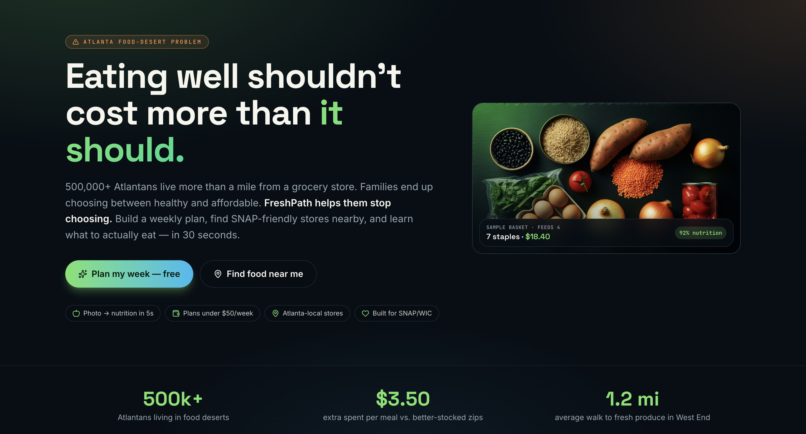
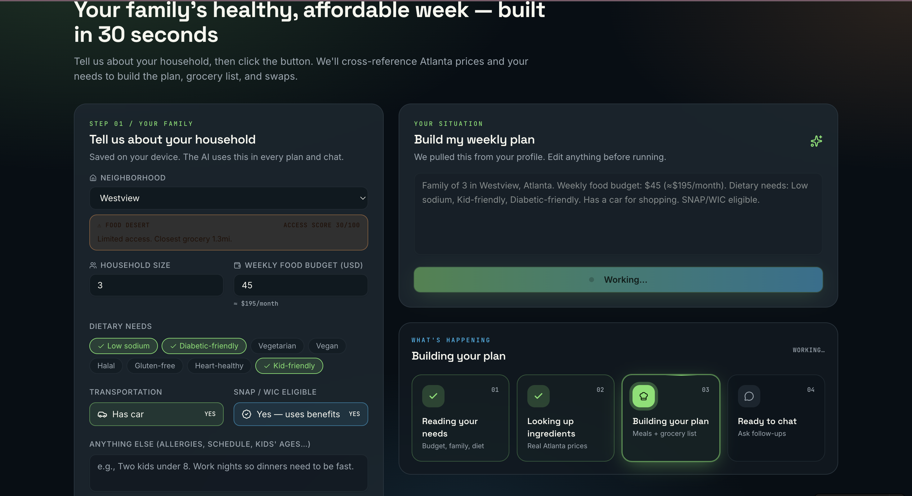
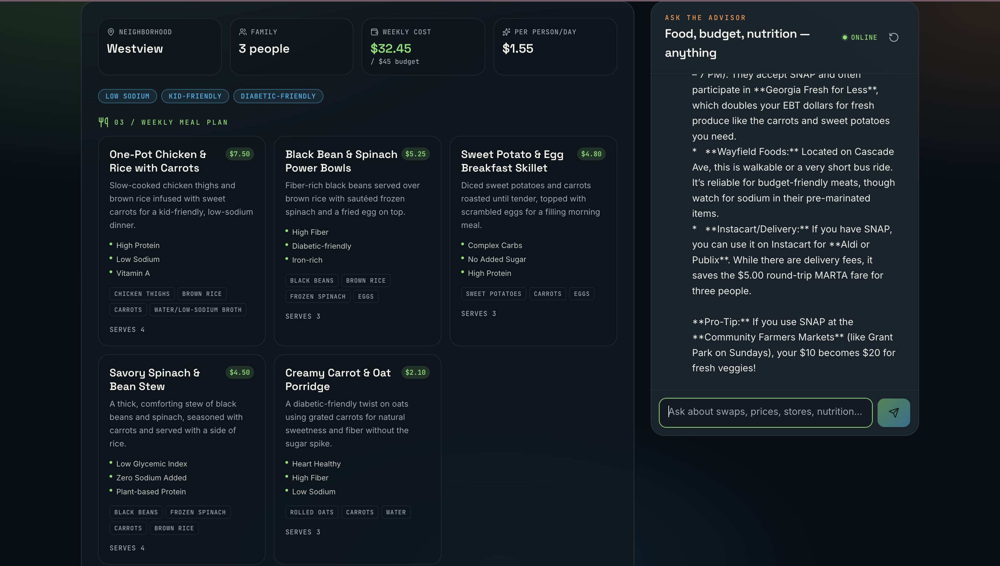
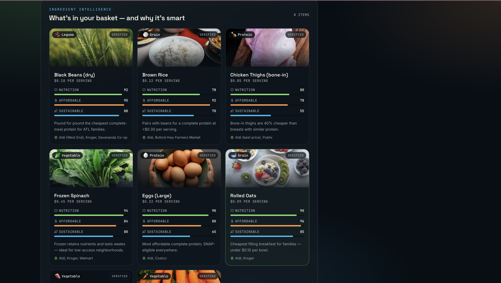
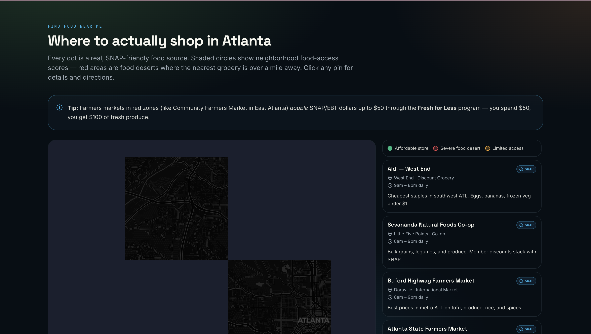
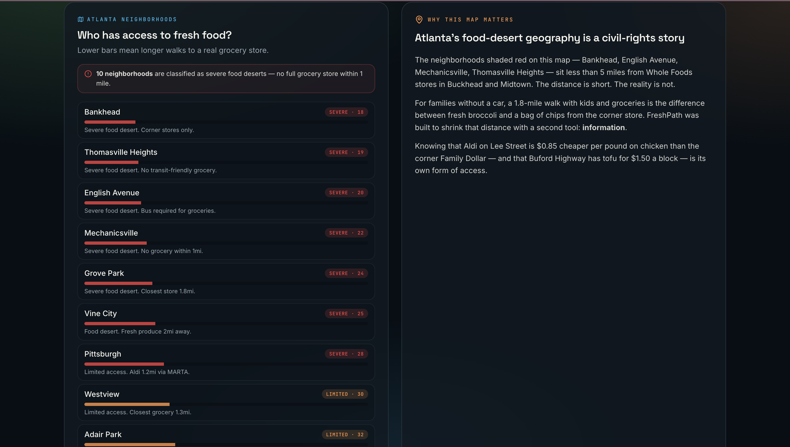
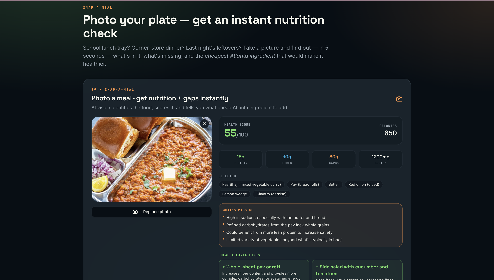
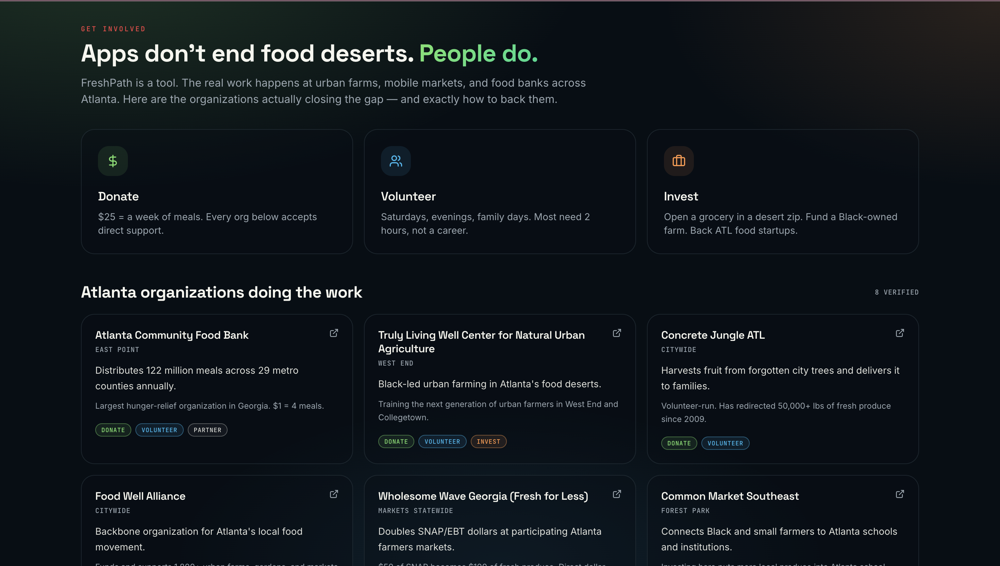

# 🥦 FreshPath ATL

> **Eating well shouldn't cost more than it should.**
>
> An AI-powered food-access app that helps Atlanta families in food deserts eat healthier on a tight budget — by planning weekly meals, mapping SNAP-friendly stores, and snapping photos for instant nutrition swaps.

🌐 **Live app:** https://freshpathatl.lovable.app

---

## 🎯 The Problem

Combined **two** Food A.I. Hackathon problem statements:

1. **Eating well costs more than it should.** Families on a budget are forced to choose between healthy and affordable, and the tools that exist don't bridge the gap.
2. **Atlanta food access.** 500,000+ Atlantans live more than a mile from a full-service grocery store. Families in West End, Bankhead, Vine City, Mechanicsville, and parts of South DeKalb pay up to **$3.50 more per meal** for the same staples found in better-stocked zip codes.

FreshPath bridges that gap with one app that plans, locates, and coaches — using **real Atlanta prices, real SNAP-accepting stores, and real nutrition data**.

---

## ✨ What the app does

| Page | Tool | What it solves |
|------|------|----------------|
| `/plan` | **Plan my week** | Tell us budget + family size → get a 5-meal plan, grocery list, money-saving swaps, and ingredient intelligence in ~20 seconds. |
| `/map` | **Find food near me** | Interactive Leaflet map of 8 SNAP-friendly Atlanta stores + 14 neighborhood access scores (food desert heatmap). |
| `/snap` | **Snap a meal** | Upload any meal photo → vision AI returns a health score, macro estimates, and cheap Atlanta-sourced fixes. |
| `/involved` | **Get involved** | Direct links to Atlanta Community Food Bank, Wholesome Wave Georgia, Open Hand Atlanta, Concrete Jungle. |

---

## 🤖 Multi-Agent Architecture (RAG pipeline)

All agents live in `src/lib/agents.functions.ts` and run as TanStack Start **server functions** on Cloudflare Workers. The LLM is reached through the **Lovable AI Gateway** (`src/lib/ai.ts`).

```
User input ─▶ ① Analyzer ─▶ ② Fetcher (RAG) ─▶ ③ Planner ─▶ ④ Advisor (chat)
                                                            └▶ ⑤ Vision (Snap-a-Meal)
```

| # | Agent | Model | Role |
|---|-------|-------|------|
| 1 | **Situation Analyzer** | `google/gemini-3-flash-preview` | Parses free-text family request → strict JSON `{location, budget, familySize, dietaryNeeds, ingredients, notes}`. |
| 2 | **Journey Foods Fetcher** | — (RAG, no LLM) | Calls `lookupIngredients()` which hits the **Journey Foods API** first, then falls back to a curated Atlanta-priced corpus of 14 staples. This is the **retrieval** step of the RAG. |
| 3 | **Meal Planner** | `google/gemini-3-flash-preview` | Grounded on the fetched ingredient intel → returns a 5-meal weekly plan, grocery list, swaps, and a budget summary. |
| 4 | **Food Advisor** | `google/gemini-3-flash-preview` | Chat agent with the current profile + plan in context. Answers any food/nutrition/budget question. |
| 5 | **Meal Vision** | `google/gemini-2.5-flash` | Multimodal — sees a meal photo, returns macros, health score, and cheap Atlanta fixes. |

**Why this is real RAG:** the Planner is *never* allowed to invent prices. It only writes plans against the structured ingredient documents returned by the Fetcher — which themselves come from the Journey Foods API + curated Atlanta corpus.

---

## 🧠 The LLM 

Used **Google Gemini** models, but we **don't call Google directly**. Every model call goes through the **Lovable AI Gateway** (`https://ai.gateway.lovable.dev/v1/chat/completions`), which handles the API key, billing, and rate limits for us. Our code never sees a Google API key.

Two models, picked on purpose:

| Model | Where we use it | Why |
|---|---|---|
| **`google/gemini-3-flash-preview`** | Agents 1, 3, 4 — Analyzer, Planner, Advisor (all text) | Fast (~1–2s per call), cheap, great at following strict JSON instructions. Perfect for a live demo. |
| **`google/gemini-2.5-flash`** | Agent 5 — Snap-a-Meal (vision) | Multimodal — it can actually *see* the uploaded meal photo and return macros + a health score. |

**One trick that keeps the demo reliable:** for every agent that needs structured data (Analyzer, Planner, Vision), we set `response_format: { type: "json_object" }`. That forces the model to return a valid JSON object instead of prose — so our UI never has to guess or regex-parse the answer. The file `src/lib/ai.ts` is the ~50-line helper that wraps all of this.

---

## 🔌 Journey Foods API integration

File: `src/lib/journey-data.ts`

- **Endpoint used:** `https://api.journeyfoods.io/v1/ingredients/search`
- **Auth:** `x-api-key` header (`JOURNEY_API_KEY` secret, server-side only)
- **Pattern:** `tryJourneyApi(ingredient)` with a **4-second timeout**. On success we map the response into our `IngredientIntel` shape (cost/serving, nutrition density, sustainability notes, sourcing). On timeout/failure/missing key we transparently fall back to the curated Atlanta corpus so the demo never breaks.
- **Why fallback?** Hackathon demo reliability + Atlanta-specific pricing (Aldi/Kroger/Publix shelf prices) that the public API doesn't carry.

---

## 🗺️ Atlanta data baked in

- **8 SNAP-friendly stores** with lat/lng: Aldi (West End, Edgewood), Kroger (Ponce, Moreland), Publix (Midtown), Sevananda Co-op, Buford Hwy Farmers Market, Atlanta State Farmers Market.
- **14 neighborhoods** with access scores 0–100: West End, Bankhead, Vine City, Mechanicsville, English Avenue, Pittsburgh, Adair Park, Edgewood, Kirkwood, East Atlanta, Old Fourth Ward, Midtown, Buckhead, Decatur.
- **14 staple ingredients** with Atlanta cost-per-serving: beans, rice, lentils, eggs, chicken thighs, spinach, sweet potato, oats, peanut butter, bananas, frozen broccoli, cabbage, tofu, canned tomatoes.

---

## 🧱 Tech Stack

| Layer | Choice |
|-------|--------|
| Framework | **TanStack Start v1** (React 19, file-based routing, server functions) |
| Runtime | **Cloudflare Workers** (V8 edge runtime, via Lovable Cloud) |
| Language | **TypeScript end-to-end** — no Python, no Node server |
| Styling | **Tailwind CSS v4** + custom "Mission Control" design tokens (Navy / Forest Green / Coral) in `src/styles.css` |
| UI primitives | shadcn/ui + lucide-react icons |
| Map | **Leaflet + react-leaflet** with Carto dark basemap |
| Validation | **Zod** on every server function input |
| AI Gateway | Lovable AI → Google Gemini 3 Flash + Gemini 2.5 Flash (vision) |
| External API | **Journey Foods API** (ingredient intelligence) |

---

## 📁 Key files

```
src/
├── routes/
│   ├── index.tsx          # Landing page
│   ├── plan.tsx           # Plan my week — agents 1-4
│   ├── map.tsx            # Atlanta SNAP-friendly store map
│   ├── snap.tsx           # Snap-a-meal vision agent
│   └── involved.tsx       # Atlanta orgs to donate/volunteer
├── lib/
│   ├── agents.functions.ts  # 5-agent pipeline (server functions)
│   ├── ai.ts                # Lovable AI Gateway helper
│   ├── journey-data.ts      # Journey API + Atlanta corpus + stores
│   └── profile.ts           # Family profile + neighborhood access
└── components/freshpath/    # All FreshPath UI
```

---

## 🚀 Run locally

```bash
bun install
bun run dev
```

Set these env vars (auto-provisioned by Lovable Cloud):
- `LOVABLE_API_KEY` — Lovable AI Gateway
- `JOURNEY_API_KEY` — Journey Foods API (optional; falls back to curated corpus)

---

## 📸 Screenshots

### Home


### Plan my week




### Find food near me



### Snap a meal


### Get Involved


---

## 🏆 Built for the Atlanta Food A.I. Hackathon

**Roadmap:** SMS/WhatsApp interface for users without smartphones, SNAP-balance API integration, and partnerships with Atlanta Community Food Bank + Wholesome Wave Georgia.

---

_Made with 💚 in Atlanta._
